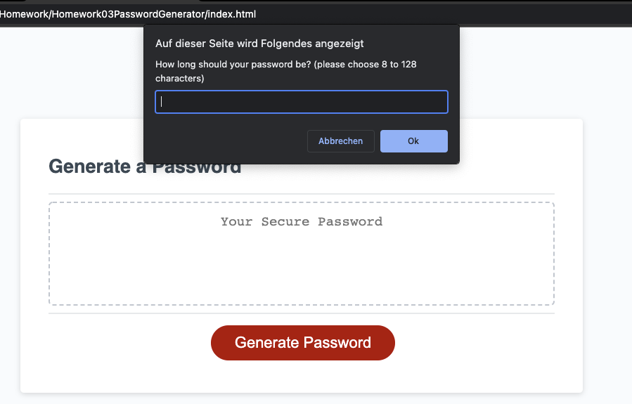
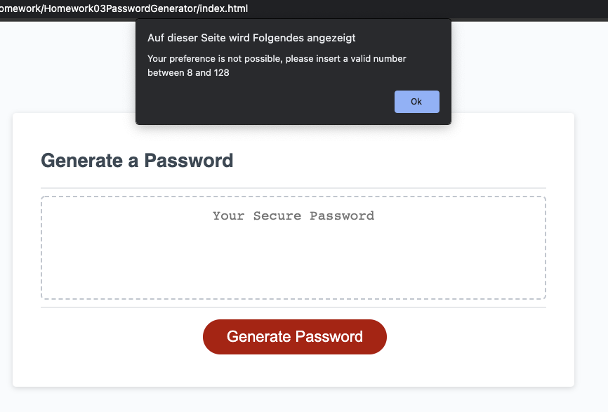
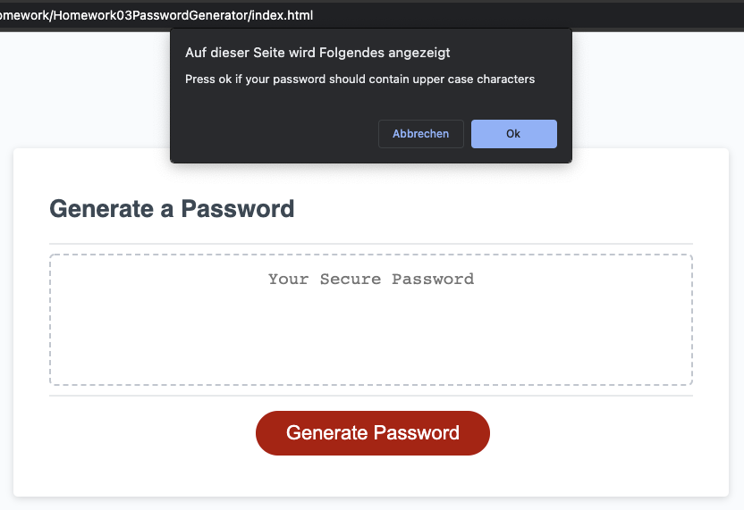
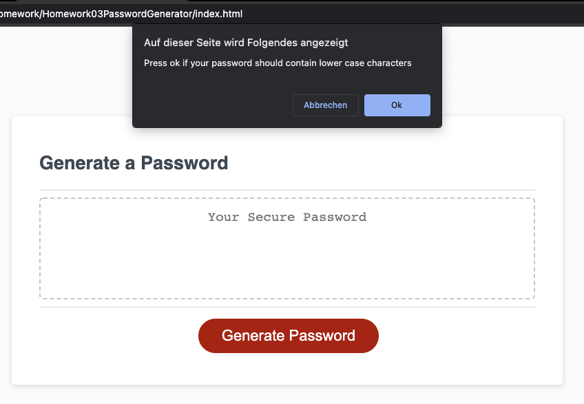
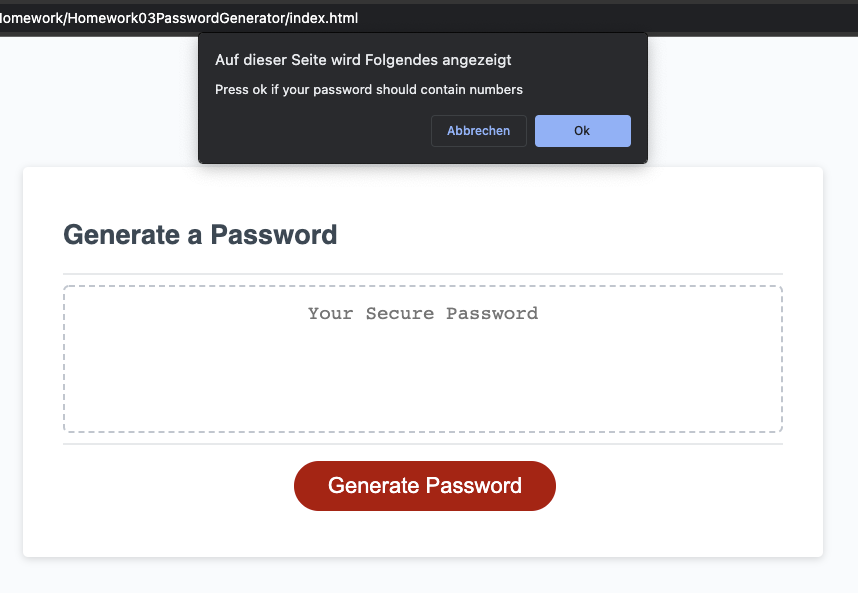
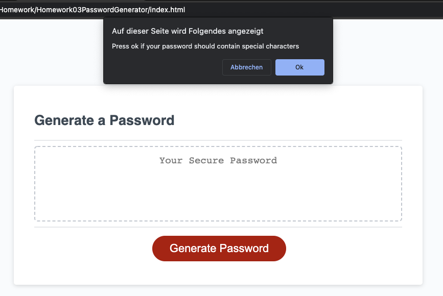
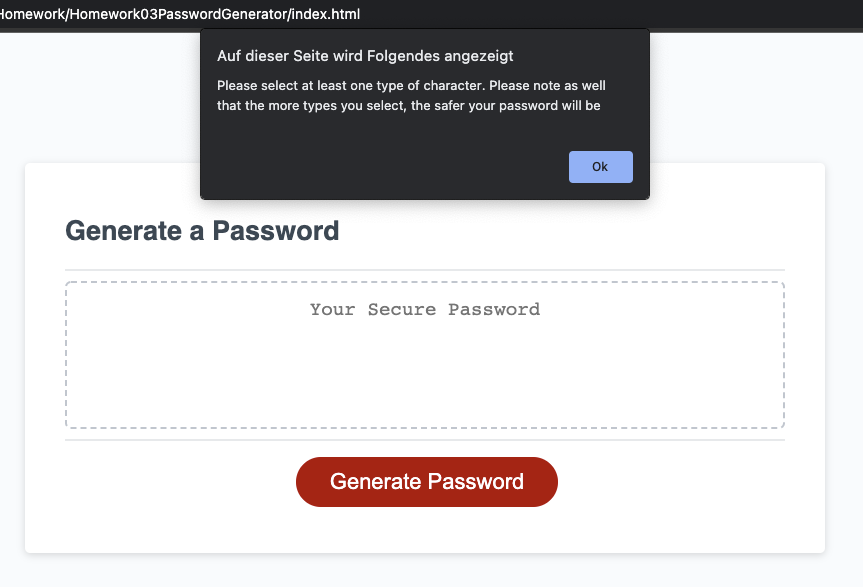
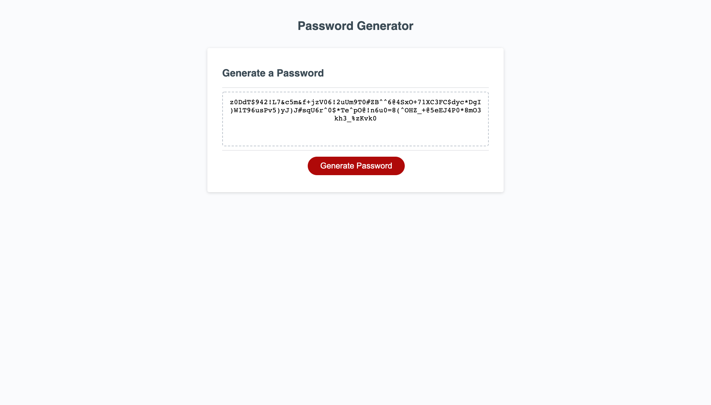

# Homework03PasswordGenerator

Repository used to hand in the homework from week 3 (Password Generator)

# Links to the files

- [GitHub Repository](https://github.com/laeuler/Homework03PasswordGenerator)
- [GitHub Page](https://laeuler.github.io/Homework03PasswordGenerator/)

# Logic of the code explained

1. line 112 triggers writePassword function once the button is clicked
2. writePassword consists of two parts
   - generate Password
   - write the password to the text box so you can copy it
3. Ask for the password criteria
   - ask for pwLength and validate if between 8 and 128 characters or a number, otherwise start from the beginning
   - check for upper case, lower case, special characters and numbers
   - if nothing of the above is checked generatePassword and criteria process is started again
4. Create the password
   - 4 if loops that check wether to include character type
   - loop through all 4 if loops until pwLength is reached
   - priority 1: each character type is represented at least twice for a pwLength with 8 characters
   - simplicity approach: almost even distribution of character types
   - last step: shuffle the created string to prevent easy predictability and increase security

Note: I had test runs (1 out of approx. 50), where a password has been created properly (logged it to the console) but the result after the shuffle was "undefined".

# Mock-Up

The following image shows the web application's appearance and functionality:
Screenshotted with Google Chrome

Screen capture shown below made with Chrome Extension Go Full Page.

## Dialogue to get criteria for password

### Number of Characters

### Error if number is not valid

### Ask for Upper Case Characters

### Ask for Lower Case Characters

### Ask for Numbers

### Asl for Special Characters

### Error if nothing is selected

## Result

# Closing Remarks

Looking forward to the feedback to learn more.
Lars
